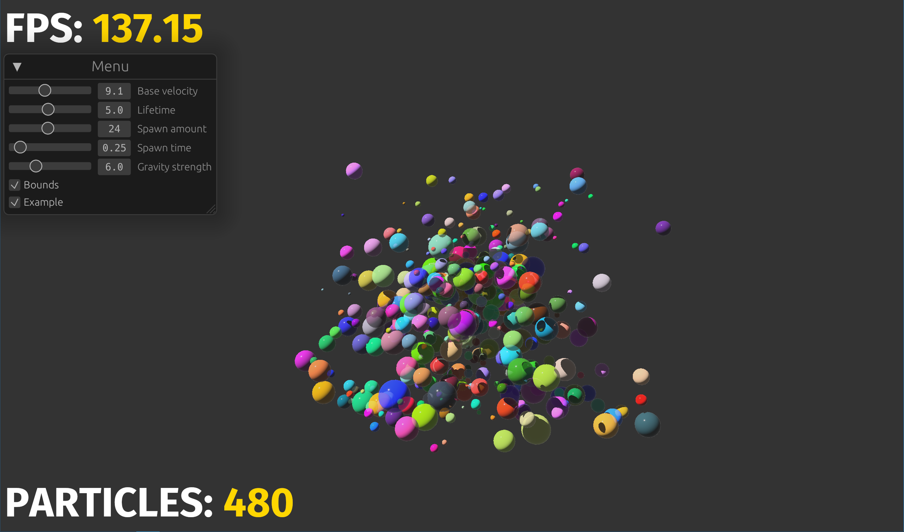
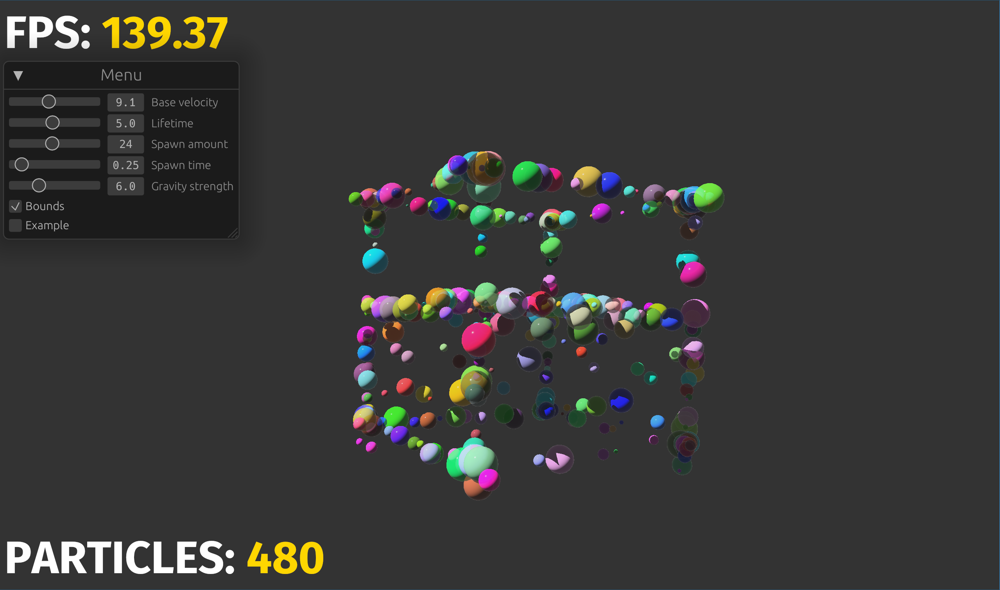
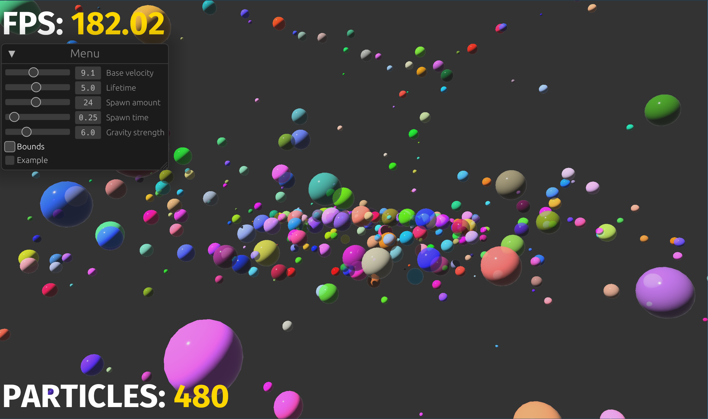

# 3D Particle Simulation

## Possible improvements

- Use the GPU for rendering
- Better camera controls

### Info

- This was a small school project for an exercise in a class
- Built in 2 days

### New things I learned

- Working with 3D objects
- Bevy 3D rendering

### Showcase

